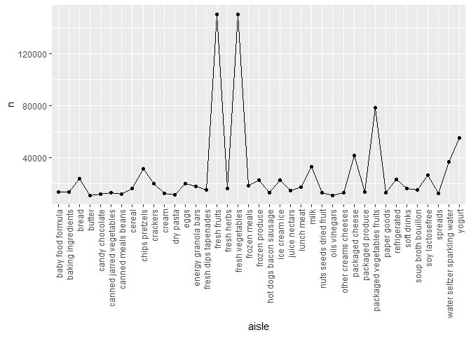
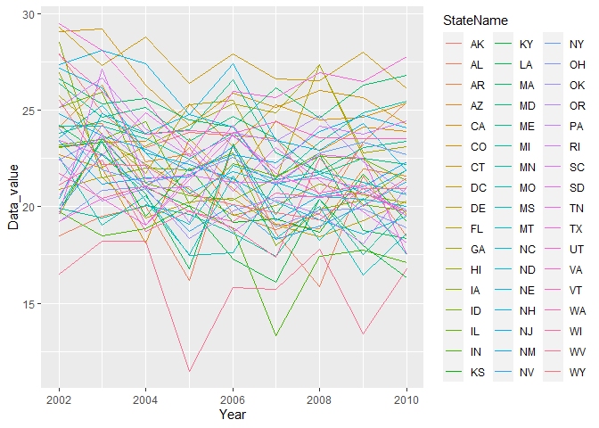
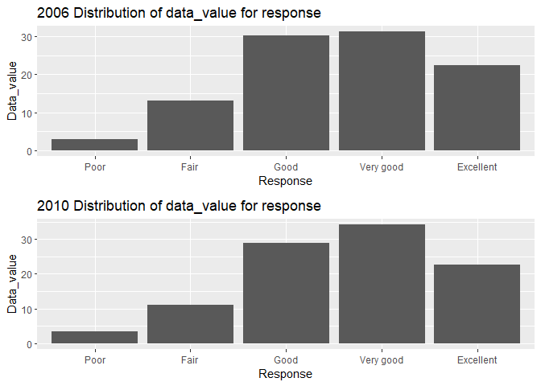
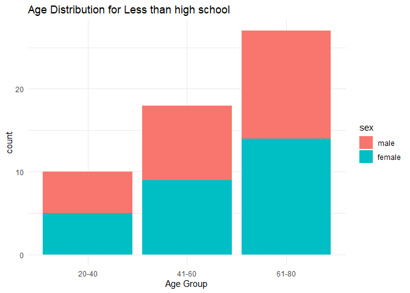
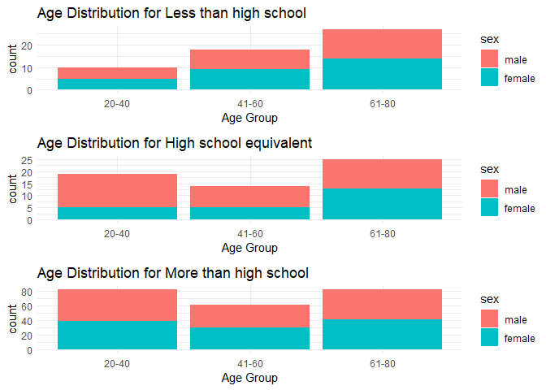
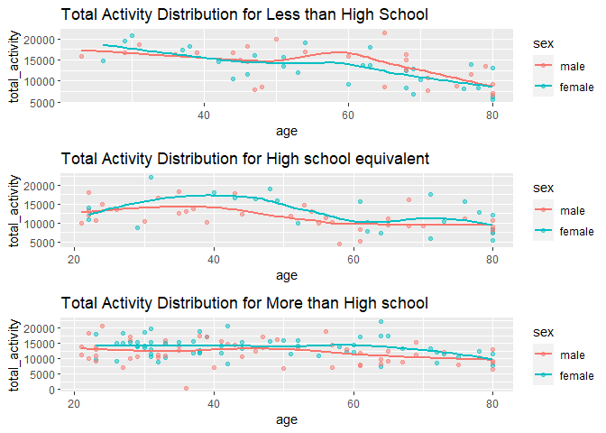
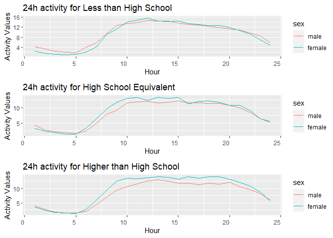

p8105_hw3_rd3097
================
RUOYING DENG
2023-10-07

Necessary Library

``` r
library(p8105.datasets)
#install.packages('cowplot')
library(tidyverse)
```

    ## ── Attaching core tidyverse packages ──────────────────────── tidyverse 2.0.0 ──
    ## ✔ dplyr     1.1.3     ✔ readr     2.1.4
    ## ✔ forcats   1.0.0     ✔ stringr   1.5.0
    ## ✔ ggplot2   3.4.3     ✔ tibble    3.2.1
    ## ✔ lubridate 1.9.2     ✔ tidyr     1.3.0
    ## ✔ purrr     1.0.2     
    ## ── Conflicts ────────────────────────────────────────── tidyverse_conflicts() ──
    ## ✖ dplyr::filter() masks stats::filter()
    ## ✖ dplyr::lag()    masks stats::lag()
    ## ℹ Use the conflicted package (<http://conflicted.r-lib.org/>) to force all conflicts to become errors

``` r
library(cowplot)
```

    ## 
    ## 载入程辑包：'cowplot'
    ## 
    ## The following object is masked from 'package:lubridate':
    ## 
    ##     stamp

``` r
#install.packages("gridExtra")
library(gridExtra)
```

    ## 
    ## 载入程辑包：'gridExtra'
    ## 
    ## The following object is masked from 'package:dplyr':
    ## 
    ##     combine

``` r
data("instacart")

# 1）
instacart %>%
  count(aisle) %>%
  arrange(desc(n))
```

    ## # A tibble: 134 × 2
    ##    aisle                              n
    ##    <chr>                          <int>
    ##  1 fresh vegetables              150609
    ##  2 fresh fruits                  150473
    ##  3 packaged vegetables fruits     78493
    ##  4 yogurt                         55240
    ##  5 packaged cheese                41699
    ##  6 water seltzer sparkling water  36617
    ##  7 milk                           32644
    ##  8 chips pretzels                 31269
    ##  9 soy lactosefree                26240
    ## 10 bread                          23635
    ## # ℹ 124 more rows

There are 1384617 rows and 15 columns in the dataset ‘instacart’. Each
row represents a product from one order. While columns including order
id, user id and product id, other identifiers like aisles, aisles id,
and department id locates the product. Other variables describing the
day and time of the order, and number of days since prior order.

There are 134 aisles in the dataset and the most items ordered from
fresh vegetables.

``` r
# 2) Make a plot that shows the number of items ordered in each aisle, limiting this to aisles with more than 10000 items ordered.
Q1_2 <- instacart %>%
  count(aisle) %>%
  filter(n > 10000) %>%
  arrange(desc(n))

ggplot(data = Q1_2, aes(x = aisle, y= n, group = 1)) +
  geom_line()+
  geom_point()+
  theme(axis.text.x = element_text(angle = 90, vjust = 0.5, hjust=1))
```

<!-- -->

``` r
# 3) Make a table showing the three most popular items in each of the aisles “baking ingredients”, “dog food care”, and “packaged vegetables fruits”. Include the number of times each item is ordered in your table.

instacart %>%
  filter(aisle %in% c('baking ingredients', 'dog food care', 'packaged vegetables fruits')) %>%
  group_by(aisle) %>%
  count(product_name, sort = TRUE) %>%
  top_n(3)
```

    ## Selecting by n

    ## # A tibble: 9 × 3
    ## # Groups:   aisle [3]
    ##   aisle                      product_name                                      n
    ##   <chr>                      <chr>                                         <int>
    ## 1 packaged vegetables fruits Organic Baby Spinach                           9784
    ## 2 packaged vegetables fruits Organic Raspberries                            5546
    ## 3 packaged vegetables fruits Organic Blueberries                            4966
    ## 4 baking ingredients         Light Brown Sugar                               499
    ## 5 baking ingredients         Pure Baking Soda                                387
    ## 6 baking ingredients         Cane Sugar                                      336
    ## 7 dog food care              Snack Sticks Chicken & Rice Recipe Dog Treats    30
    ## 8 dog food care              Organix Chicken & Brown Rice Recipe              28
    ## 9 dog food care              Small Dog Biscuits                               26

``` r
# To ensure the dataset has distinct product name for each order on rows level 
instacart %>%
  group_by(order_id) %>%
  count(product_name) %>%
  ungroup(order_id) %>%
  arrange(desc(n))
```

    ## # A tibble: 1,384,617 × 3
    ##    order_id product_name                                      n
    ##       <int> <chr>                                         <int>
    ##  1        1 Bag of Organic Bananas                            1
    ##  2        1 Bulgarian Yogurt                                  1
    ##  3        1 Cucumber Kirby                                    1
    ##  4        1 Lightly Smoked Sardines in Olive Oil              1
    ##  5        1 Organic 4% Milk Fat Whole Milk Cottage Cheese     1
    ##  6        1 Organic Celery Hearts                             1
    ##  7        1 Organic Hass Avocado                              1
    ##  8        1 Organic Whole String Cheese                       1
    ##  9       36 Asparagus                                         1
    ## 10       36 Cage Free Extra Large Grade AA Eggs               1
    ## # ℹ 1,384,607 more rows

``` r
# 4) Make a table showing the mean hour of the day at which Pink Lady Apples and Coffee Ice Cream are ordered on each day of the week

# dow 0-6; hourly 0-23; productName = coffee ice cream, pink Lady Apples
instacart %>%
  filter(product_name %in% c('Coffee Ice Cream', 'Pink Lady Apples')) %>%
  group_by(product_name,order_dow) %>%
  summarize(Mean = mean(order_hour_of_day, na.rm = TRUE)) %>%
  pivot_wider(names_from = order_dow, values_from = Mean)
```

    ## `summarise()` has grouped output by 'product_name'. You can override using the
    ## `.groups` argument.

    ## # A tibble: 2 × 8
    ## # Groups:   product_name [2]
    ##   product_name       `0`   `1`   `2`   `3`   `4`   `5`   `6`
    ##   <chr>            <dbl> <dbl> <dbl> <dbl> <dbl> <dbl> <dbl>
    ## 1 Coffee Ice Cream  13.8  14.3  15.4  15.3  15.2  12.3  13.8
    ## 2 Pink Lady Apples  13.4  11.4  11.7  14.2  11.6  12.8  11.9

## Problem 2

``` r
data("brfss_smart2010")

# Focus Overall Health only

Q2 <- brfss_smart2010 %>%
  # format the data to use appropriate variable names by changing Location abbr to State Name and Location desc to County Name
  rename("StateName" = "Locationabbr") |>
  rename("CountyName" = "Locationdesc") |>
  # focus on the “Overall Health” topic
  filter(Topic == 'Overall Health')%>%
  # include only responses from “Excellent” to “Poor” and organize responses as a factor taking levels ordered from “Poor” to “Excellent”
  group_by(Response) %>%
    filter(Response == "Excellent" | Response =="Very good" |Response =="Good" |Response =="Fair" |Response =="Poor") %>%
  mutate(Response = factor(Response, levels = c('Poor', 'Fair', 'Good', 'Very good', 'Excellent'))) %>%
  ungroup(Response)


# In 2002, filter states that were observed at 7 or more locations
Q2_2002<- Q2 %>%
  filter(Year == 2002) %>%
  group_by(StateName) %>%
  summarize(locationDistinctCount = n_distinct(CountyName)) %>%
  filter(locationDistinctCount >=7)

#In 2010,filter states that were observed at 7 or more locations
Q2_2010 <- Q2 %>%
  filter(Year == 2010) %>%
  group_by(StateName) %>%
  summarize(locationDistinctCount = n_distinct(CountyName)) %>%
  filter(locationDistinctCount >=7)
```

In 2002, there are 6 states that were observed at 7 or more locations,
and they are CT, FL, MA, NC, NJ, PA while in 2010 there are 14 states
that were observed at 7 or more locations which are CA, CO, FL, MA, MD,
NC, NE, NJ, NY, OH, PA, SC, TX, WA.

``` r
# Construct a dataset that is limited to Excellent responses, and contains, year, state, and a variable that averages the data_value across locations within a state. Make a “spaghetti” plot of this average value over time within a state.

Q2_lineplot <- Q2 %>%
  filter(Response == 'Excellent') %>%
  select(Year,StateName , Data_value) %>%
  group_by(Year, StateName) %>%
  summarize(Data_value = mean(Data_value, na.rm = TRUE)) %>%
  ungroup(Year, StateName)
```

    ## `summarise()` has grouped output by 'Year'. You can override using the
    ## `.groups` argument.

``` r
ggplot(data = Q2_lineplot, aes(x = Year, y = Data_value)) +
  geom_line(aes(color = StateName))
```

<!-- --> the
spaghetti plot of average value over time within in a state shows that
for most states, people who response excellent for their health tends to
have less average data value over time. The fluctation varies in
different states.

``` r
# Make a two-panel plot showing, for the years 2006, and 2010, distribution of data_value for responses (“Poor” to “Excellent”) among locations in NY State.

Q2_2006 <- Q2 %>%
  filter(StateName == 'NY' & Year == 2006)

Q2_2010 <- Q2 %>%
  filter(StateName == 'NY' & Year == 2010) 

Q2Plot1 <- ggplot(Q2_2006, aes(x = Response, y = Data_value)) +
  geom_bar(stat = 'summary', fun = 'mean') +
  labs(title = "2006 Distribution of data_value for response")
Q2Plot2 <- ggplot(Q2_2010, aes(x = Response, y = Data_value)) +
  geom_bar(stat = 'summary', fun = 'mean') +
  labs(title = "2010 Distribution of data_value for response")


plot_grid(Q2Plot1, Q2Plot2, align = "v", ncol = 1, rel_heights = c(.5, .5))
```

<!-- -->

In 2006, most people response that they believe they are good or very
good health condition. There are 30 responses in total. People response
`Very good` the most while response `Poor` the least.

In 2010, most people also response that they believe they are good or
very good condition. There are 45 responses in total. People response
`Very good` the most while response `Poor` the least.

## Problem 3

``` r
#include all originally observed variables
covar <- read.csv("nhanes_covar.csv",skip =4)
accel <-read.csv("nhanes_accel.csv")
tidied_covar <- covar %>%
  #exclude participants less than 21 years of age
  filter(age >= 21)%>%
  #exclude those with missing demographic data
  drop_na(BMI, education)%>%
  #encode data with reasonable variable classes in factor instead of numerical
  mutate(sex = factor(recode(sex, "1" = "male", "2" = "female"), levels =c("male", "female")),
         education = factor(recode(education, "1"="Less than high school", "2" = "High school equivalent", "3" = "More than high school"),levels = c("Less than high school","High school equivalent", "More than high school")))
```

``` r
#Produce a reader-friendly table for the number of men and women in each education category, since education is factor, we need to transfer the factor to numeric first for counting
problem3_2 <- transform(tidied_covar, education = as.numeric(education)) %>%
  group_by(sex,education)%>%
  summarise(number_of_people = sum(education))%>%
#then for a reader-friendly table, we need to tranfer the variable in education column back to character
  mutate(education = recode(education, "1"="Less than high school", "2" = "High school equivalent", "3" = "More than high school"))%>%
  ungroup(sex, education)
```

    ## `summarise()` has grouped output by 'sex'. You can override using the `.groups`
    ## argument.

comment on the table: most of women and men’s education are both more
than high school.

``` r
#create a visualization of the age distributions for men and women in each education category

#max age is 80
age_distribution<-tidied_covar%>%
  # Define age distribution groups
  mutate(age_groups = cut(age, breaks = c(20, 40, 60, 80),labels = c("20-40", "41-60", "61-80")))
 
#First we make plot for education less than high school
Less_high <- age_distribution %>%
  filter(education == "Less than high school")

age_group_counts1 <- Less_high %>%
  group_by(age_groups,sex) %>%
  summarise(count = n(), .groups = 'drop')  
#Second we make plot for education level High school equivalent
Equi_high <- age_distribution %>%
  filter(education == "High school equivalent")

age_group_counts2 <- Equi_high %>%
  group_by(age_groups,sex) %>%
  summarise(count = n(), .groups = 'drop')
#Third we make plot for education level More than high school 
More_high <- age_distribution%>%
  filter(education == "More than high school")


age_group_counts3 <- age_distribution %>%
  group_by(age_groups,sex) %>%
  summarise(count = n(), .groups = 'drop')

#Then we make plot for each education level
plot1<- ggplot(age_group_counts1, aes(x = age_groups, y = count, fill = sex)) +
  geom_bar(stat = "identity") +
  labs(x = "Age Group") +
  ggtitle("Age Distribution for Less than high school") +
  theme_minimal()
print(plot1)
```

<!-- -->

``` r
plot2<- ggplot(age_group_counts2, aes(x = age_groups, y = count, fill = sex)) +
  geom_bar(stat = "identity") +
  labs(x = "Age Group") +
  ggtitle("Age Distribution for High school equivalent") +
  theme_minimal()

plot3<- ggplot(age_group_counts3, aes(x = age_groups, y = count, fill = sex)) +
  geom_bar(stat = "identity") +
  labs(x = "Age Group") +
  ggtitle("Age Distribution for More than high school ") +
  theme_minimal()

plot_grid(plot1, plot2, plot3, align = "v", ncol = 1, rel_heights = c(.5, .5))
```

<!-- -->

comment: except for age group 20-40 and 41-60 of high school equivalent,
where number of female are much less than the number of male, all other
age groups in different education number has almost same number of
female and male.

``` r
#Using tidied dataset, aggregate across minutes to create a total activity variable for each participant
tidied_accel <- accel%>%
  mutate(total_activity = rowSums(accel[,-1]))%>%
  select(SEQN,total_activity,everything())

clean_data = 
  left_join(tidied_covar,tidied_accel, by = "SEQN")

#Plot these total activities (y-axis) against age (x-axis),plot should compare men to women and have separate panels for each education level, Include a trend line

#First for education level less than high school
clean_data_less<- filter(clean_data, education == "Less than high school" )
total_activities_plot_1= 
  clean_data_less |> 
  ggplot(aes(x = age, y = total_activity, color = sex)) + 
  ggtitle("Total Activity Distribution for Less than High School") +
  geom_point(alpha = .5) +
  geom_smooth(se = FALSE)

#Second for education level equivalent to high schhol
clean_data_equi<- filter(clean_data, education == "High school equivalent" )
total_activities_plot_2= 
  clean_data_equi |> 
  ggplot(aes(x = age, y = total_activity, color = sex)) + 
  ggtitle("Total Activity Distribution for High school equivalent") +
  geom_point(alpha = .5) +
  geom_smooth(se = FALSE)

#Third for education level higher than high school
clean_data_higher<- filter(clean_data, education == "More than high school" ) 
total_activities_plot_3= 
  clean_data_higher |> 
  ggplot(aes(x = age, y = total_activity, color = sex)) + 
  ggtitle("Total Activity Distribution for More than High school") +
  geom_point(alpha = .5) +
  geom_smooth(se = FALSE)

plot_grid(total_activities_plot_1, total_activities_plot_2, total_activities_plot_3, align = "v", ncol = 1, rel_heights = c(.5, .5))
```

    ## `geom_smooth()` using method = 'loess' and formula = 'y ~ x'
    ## `geom_smooth()` using method = 'loess' and formula = 'y ~ x'
    ## `geom_smooth()` using method = 'loess' and formula = 'y ~ x'

<!-- -->

These trendline illustrates that for education level less than high
school, male and female has almost the same total activity except that
male has a bit larger total activity time for age over 50.

For education level equivalent to high school, female has larger total
activity distribution than male except for age around 63 where female
has almost same total activity time as male.

For education level higher than high school, female has a bit larger
total activity time than male except for age 47 where female has almost
same total activity time as male.

``` r
#Make a three-panel plot that shows the 24-hour activity time courses for each education level and use color to indicate sex. 

#First for data with education level less than high school
long_clean_data_less <- clean_data_less %>%
  pivot_longer(cols = c(min1: min1440), names_to = "Time", values_to = "Value")

#combine rows based on the time interval an hour
Time_Final_Less <- long_clean_data_less %>%
  mutate(Hour = (as.numeric(sub("min", "", Time)) - 1) %/% 60 + 1) %>%
  group_by(sex, Hour) %>%
  mutate(Hour_Value = mean(Value))%>%
  distinct(sex, Hour, Hour_Value)


plot_less <- ggplot(Time_Final_Less, aes(x = Hour, y = Hour_Value, color = sex)) +
  geom_line(stat = "identity") +
  labs(x = "Hour", y = "Activity Values") +
  ggtitle("24h activity for Less than High School")+
  theme(axis.text.x = element_text(angle = 0, vjust = 0.5, hjust=1)) 

#Second for data with education level equivalent to high school 
long_clean_data_equi <- clean_data_equi %>%
  pivot_longer(cols = c(min1: min1440), names_to = "Time", values_to = "Value")

#combine rows based on the time interval an hour
Time_Final_Equi <- long_clean_data_equi %>%
  mutate(Hour = (as.numeric(sub("min", "", Time)) - 1) %/% 60 + 1) %>%
  group_by(sex, Hour) %>%
  mutate(Hour_Value = mean(Value))%>%
  distinct(sex, Hour, Hour_Value)


plot_equal <- ggplot(Time_Final_Equi, aes(x = Hour, y = Hour_Value, color = sex)) +
  geom_line(stat = "identity") +
  labs(x = "Hour", y = "Activity Values") +
  ggtitle("24h activity for High School Equivalent")+
  theme(axis.text.x = element_text(angle = 0, vjust = 0.5, hjust=1))

#Third for data with education level higher than high school
long_clean_data_higher <- clean_data_higher %>%
  pivot_longer(cols = c(min1: min1440), names_to = "Time", values_to = "Value")

#combine rows based on the time interval an hour
Time_Final_Higher <- long_clean_data_higher %>%
  mutate(Hour = (as.numeric(sub("min", "", Time)) - 1) %/% 60 + 1) %>%
  group_by(sex, Hour) %>%
  mutate(Hour_Value = mean(Value))%>%
  distinct(sex, Hour, Hour_Value)


plot_higher <-ggplot(Time_Final_Higher, aes(x = Hour, y = Hour_Value, color = sex)) +
  geom_line(stat = "identity") +
  labs(x = "Hour", y = "Activity Values") +
  ggtitle("24h activity for Higher than High School")+
  theme(axis.text.x = element_text(angle = 0, vjust = 0.5, hjust=1))

plot_grid(plot_less, plot_equal, plot_higher, align = "v", ncol = 1, rel_heights = c(.5, .5))
```

<!-- -->
The overall 24H activity value for all three education level looks
similar, first, they are decrease till 5H because they are in sleep,
then they all increase around 5H to 12H when they become awake, and
achieve its peak around 10H to 15h which is the afternoon. After that,
the activity value then gradually decrease after 15H when the night
comes.
